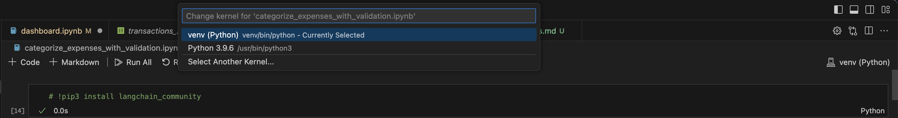

# Prerequisites:
 - [Git](https://git-scm.com/book/en/v2/Getting-Started-Installing-Git)
 - [Python](https://www.python.org/downloads/)
 - [Ollama](https://github.com/ollama/ollama?tab=readme-ov-file)
 - [VSCode](https://code.visualstudio.com/download)

# Setup

```zsh
git clone git@github.com:thu-vu92/local-llms-analyse-finance.git

cd local-llms-analyse-finance && code .

# Once opened in VSCode, Install any extenstions recommended for Jupyter and Python.

# Might serve you better to setup a python virtual env for the project
python3 -m venv venv && source venv/bin/activate
pip3 install pydantic pandas
```

 - Select the newly created python environment at top right of the Jupyter file in VSCode.


 - "Run All" in categorize_expenses_with_validation.ipynb file. You might have to uncomment the top pip3 install line since you're likely to lack the dependencies (same for other files).


 - Now that the categorized transactions are generated, 'Run All' in dashboard.ipynb (be mindful of dependencies) and your dashboard should be up and launch on local browser.
